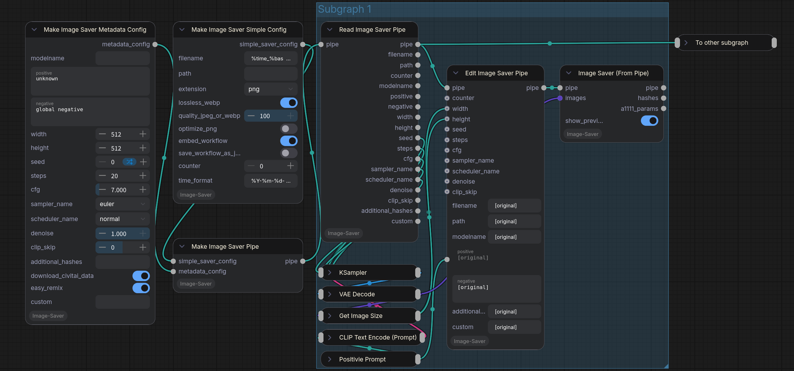

[!] Forked from https://github.com/giriss/comfy-image-saver, which seems to be inactive since a while.

# Save image with generation metadata in ComfyUI

Allows you to save images with their **generation metadata**. Includes the metadata compatible with *Civitai* geninfo auto-detection. Works with PNG, JPG and WEBP. For PNG stores both the full workflow in comfy format, plus a1111-style parameters. For JPEG/WEBP only the a1111-style parameters are stored. **Includes hashes of Models, LoRAs and embeddings for proper resource linking** on civitai.

You can find example workflows in the [`examples`](./examples) directory.

You can also add LoRAs to the prompt in \<lora:name:weight\> format, which would be translated into hashes and stored together with the metadata. For this it is recommended to use `ImpactWildcardEncode` from the fantastic [ComfyUI-Impact-Pack](https://github.com/ltdrdata/ComfyUI-Impact-Pack). It will allow you to convert the LoRAs directly to proper conditioning without having to worry about avoiding/concatenating lora strings, which have no effect in standard conditioning nodes. Here is an example:

This would have civitai autodetect all of the resources (assuming the model/lora/embedding hashes match):

## How to install?

### Method 1: Manager (Recommended)
If you have *ComfyUI-Manager*, you can simply search "**ComfyUI Image Saver**" and install these custom nodes.

### Method 2: Easy
If you don't have *ComfyUI-Manager*, then:
- Using CLI, go to the ComfyUI folder
- `cd custom_nodes`
- `git clone git@github.com:alexopus/ComfyUI-Image-Saver.git`
- `cd ComfyUI-Image-Saver`
- `pip install -r requirements.txt`
- Start/restart ComfyUI

## Customization of file/folder names

You can use following placeholders:

- `%date`
- `%time` *– format taken from `time_format`*
- `%time_format<format>` *– custom datetime format using Python strftime codes*
- `%model` *– full name of model file*
- `%basemodelname` *– name of model (without file extension)*
- `%seed`
- `%counter`
- `%counter<padding>` *– zero-padded counter (e.g. `%counter<03>` with counter 1 becomes `001`)*
- `%sampler_name`
- `%scheduler`
- `%steps`
- `%cfg`
- `%denoise`

Example:

| `filename` value | Result file name |
| --- | --- |
| `%time-%basemodelname-%cfg-%steps-%sampler_name-%scheduler-%seed` | `2023-11-16-131331-Anything-v4.5-pruned-mergedVae-7.0-25-dpm_2-normal-1_01.png` |
| `%time_format<%Y%m%d_%H%M%S>-%seed` | `20231116_131331-1.png` |
| `%time_format<%B %d, %Y> %basemodelname` | `November 16, 2023 Anything-v4.5.png` |
| `img_%time_format<%Y-%m-%d>_%seed` | `img_2023-11-16_1.png` |

**Common strftime format codes for `%time_format<format>`:**

| Code | Meaning | Example |
|------|---------|---------|
| `%Y` | Year (4-digit) | 2023 |
| `%y` | Year (2-digit) | 23 |
| `%m` | Month (01-12) | 11 |
| `%B` | Month name (full) | November |
| `%b` | Month name (short) | Nov |
| `%d` | Day (01-31) | 16 |
| `%H` | Hour 24h | 13 |
| `%I` | Hour 12h | 01 |
| `%M` | Minute | 13 |
| `%S` | Second | 31 |
| `%p` | AM/PM | PM |
| `%A` | Weekday (full) | Thursday |
| `%a` | Weekday (short) | Thu |
| `%F` | YYYY-MM-DD | 2023-11-16 |
| `%T` | HH:MM:SS | 13:13:31 |

## Optional: Pipe Integration (Advanced Orchestration)

For orchestrating complicated workflows—such as projects involving dozens of character scenarios each with multiple scenes—the standard wiring can become dense. To help manage this, an optional **Pipe** system is available.

The pipe system bundles all metadata and image saver settings into a single connection, allowing you to pass them through a workflow and branch them efficiently.

### When Should I Need Pipe?

In most cases, the standard `ImageSaverMetadata`, `ImageSaverSimple`, or `ImageSaver` nodes are recommended, as the core features are identical.

The Pipe system is primarily beneficial when your workflow becomes crowded with wires between KSamplers and metadata nodes. It acts as an orchestrator, helping you maintain a cleaner generation pipeline in complex, multi-stage environments.

#### Execution Order Observations (For Large Workflows)
Depending on your wiring strategy, ComfyUI may execute multiple KSamplers across the graph before reaching the corresponding `ImageSaverFromPipe` nodes. To optimize this, ensure that the branch containing an `ImageSaverFromPipe` node does not depend on resources from other active branches. This helps ComfyUI complete each branch sequentially, preventing unnecessary memory buildup.

For finer control in extremely large workflows, you can also use custom nodes that provide dedicated execution control.

### Features
* **Simplified Wiring:** Carries generation and saver settings in one pipe connection, useful for large-scale orchestration.
* **Deferred Execution:** Expensive operations like checkpoint hashing and Civitai API lookups are deferred until the final save operation.
* **Non-destructive Editing:** The `Edit Image Saver Pipe` node allows you to branch and modify settings. All string fields support the `[original]` placeholder (e.g., `[original], masterpiece`) to easily append or prepend text.
* **Orchestration Support:** Use the `Read Image Saver Pipe` to extract values for external manipulation before feeding them back into an `Edit` node.
* **Standard Dropdown Menus:** Sampler and scheduler inputs use combo boxes, allowing for easier direct connection to other nodes.

### Included Nodes
* **Make Image Saver Simple Config**: Standalone configuration for filename, path, and file type.
* **Make Image Saver Metadata Config**: Standalone configuration for prompts and generation parameters.
* **Make Image Saver Pipe**: Bundles the above configurations into a single pipe connection.
* **Edit Image Saver Pipe**: Overrides settings in an existing pipe (creates a new branch).
* **Read Image Saver Pipe**: Extracts settings from a pipe for inspection or external use.
* **Image Saver (From Pipe)**: Unpacks the pipe settings and saves the image.

### Workflow Consistency

The pipe system uses the same underlying logic as the standard nodes but is designed for a different workflow style.

* **Compatibility:** Standard nodes and pipe nodes have different input/output structures and are not directly interchangeable.
* **Execution Timing:** It is recommended to use one system consistently within a specific workflow branch. Standard nodes trigger side-effects (like metadata lookups) immediately upon execution. In contrast, pipe nodes defer these actions until the final saving step, allowing you to update metadata properties at multiple stages of your workflow before they are committed to disk.

